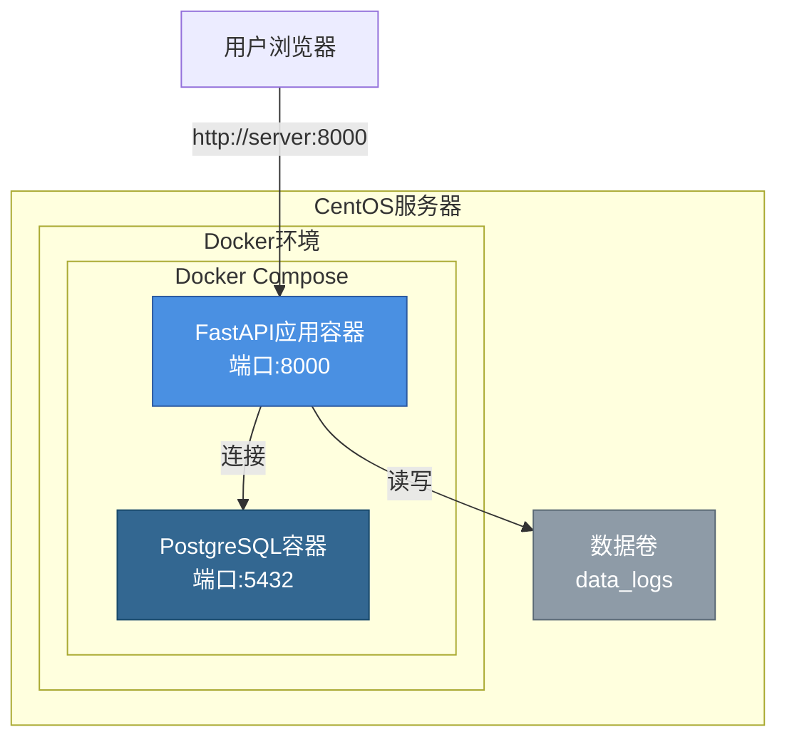

# 一键部署指南

## 概述

本脚本用于在CentOS服务器上一键部署PVP数据看板系统，使用Docker容器化部署。

## 部署架构



## 部署步骤

### 1. 准备工作

确保服务器满足以下要求：
- CentOS 7/8 或 RHEL 7/8
- Root权限
- 网络连接正常
- 至少2GB可用内存
- 至少10GB可用磁盘空间

### 2. 上传项目文件

将项目文件上传到服务器，确保包含以下文件：
- `Dockerfile`
- `docker-compose.yml`
- `requirements.txt`
- `deploy.sh`
- `backend/` 目录
- `data_logs/` 目录（可选，会自动创建）

### 3. 执行部署

```bash
# 给脚本添加执行权限
chmod +x deploy.sh

# 运行部署脚本（需要root权限）
sudo ./deploy.sh
```

### 4. 部署流程

脚本会自动执行以下步骤：

1. **系统检查**
   - 检查系统版本
   - 检查必要文件
   - 检查端口占用

2. **安装依赖**
   - 安装Docker（如果未安装）
   - 安装Docker Compose（如果未安装）

3. **部署服务**
   - 停止旧容器
   - 构建Docker镜像
   - 启动服务（PostgreSQL + FastAPI应用）

4. **健康检查**
   - 等待服务启动
   - 验证服务可用性

5. **显示状态**
   - 显示服务运行状态
   - 显示访问地址

## 部署后操作

### 查看服务状态

```bash
docker-compose ps
```

### 查看日志

```bash
# 查看所有服务日志
docker-compose logs -f

# 查看应用日志
docker-compose logs -f app

# 查看数据库日志
docker-compose logs -f postgres
```

### 停止服务

```bash
docker-compose down
```

### 重启服务

```bash
docker-compose restart
```

### 更新部署

```bash
# 拉取最新代码后，重新运行部署脚本
sudo ./deploy.sh
```

## 配置说明

### 环境变量

可以通过修改 `docker-compose.yml` 中的环境变量来配置服务：

- `POSTGRES_USER`: 数据库用户名（默认: app）
- `POSTGRES_PASSWORD`: 数据库密码（默认: app）
- `POSTGRES_DB`: 数据库名称（默认: pvp）
- `IMPORT_INTERVAL_SEC`: 自动导入间隔（秒，默认: 300）

### 端口配置

- **应用端口**: 8000（可在docker-compose.yml中修改）
- **数据库端口**: 5432（可在docker-compose.yml中修改）

### 数据持久化

- PostgreSQL数据存储在Docker卷 `pgdata` 中
- 应用日志目录 `data_logs` 挂载到容器中

## 故障排查

### 服务无法启动

1. 检查端口占用：
```bash
netstat -tuln | grep -E '8000|5432'
```

2. 查看详细日志：
```bash
docker-compose logs app
docker-compose logs postgres
```

3. 检查容器状态：
```bash
docker-compose ps
docker ps -a
```

### 数据库连接失败

1. 检查数据库容器是否运行：
```bash
docker-compose ps postgres
```

2. 检查数据库健康状态：
```bash
docker-compose exec postgres pg_isready -U app
```

3. 检查网络连接：
```bash
docker-compose exec app ping postgres
```

### 应用无法访问

1. 检查防火墙：
```bash
# CentOS 7
firewall-cmd --list-ports

# 开放端口（如果需要）
firewall-cmd --permanent --add-port=8000/tcp
firewall-cmd --reload
```

2. 检查服务健康：
```bash
curl http://localhost:8000/api/health
```

## 安全建议

1. **修改默认密码**：部署后立即修改数据库密码
2. **配置防火墙**：只开放必要的端口
3. **使用HTTPS**：生产环境建议配置反向代理和SSL证书
4. **定期备份**：定期备份PostgreSQL数据卷

## 性能优化

1. **调整资源限制**：在docker-compose.yml中添加资源限制
2. **优化数据库**：根据数据量调整PostgreSQL配置
3. **使用缓存**：考虑添加Redis缓存层

## 卸载

```bash
# 停止并删除容器
docker-compose down

# 删除数据卷（谨慎操作，会删除所有数据）
docker-compose down -v

# 卸载Docker（可选）
yum remove docker-ce docker-ce-cli containerd.io
```

