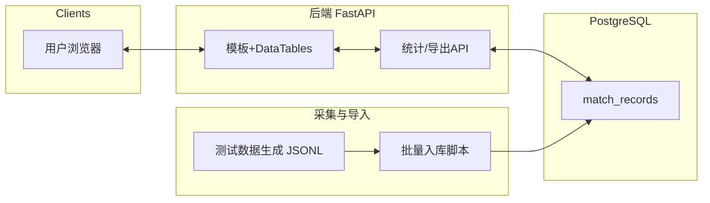

## 数据看板系统（胜率与战斗时长）

本项目提供：
- PostgreSQL 数据库（Docker）
- FastAPI 后端（聚合统计、筛选、排序、多列排序、导出CSV）
- 简易前端页面（DataTables + 过滤器 + 二级职业流派展开 + 多项排序）
- 文本日志(JSON Lines)采集与批量入库脚本
- 测试数据生成脚本

### 目录结构

```
.
├─ backend/
│  ├─ app/
│  │  ├─ main.py
│  │  ├─ database.py
│  │  ├─ models.py
│  │  ├─ schemas.py
│  │  ├─ crud.py
│  │  ├─ ingestion.py
│  │  └─ templates/
│  │     └─ index.html
├─ scripts/
│  └─ generate_test_data.py
├─ docker-compose.yml
├─ requirements.txt
└─ README.md
```

### 环境准备（WSL2 Ubuntu 22.04）

1) 安装依赖

```bash
sudo apt update
sudo apt install -y python3 python3-venv python3-pip docker.io docker-compose
```

2) 启动数据库（PostgreSQL）

```bash
docker compose up -d postgres
```

3) 创建并激活虚拟环境，安装后端依赖

```bash
python3 -m venv .venv
source .venv/bin/activate
pip install -r requirements.txt
```

4) 初始化数据库（自动建表由SQLAlchemy在首次启动或导入时完成）

5) 生成测试数据并写入本地 txt，再批量入库：

```bash
# 生成本地 JSONL 日志到 ./data_logs
python scripts/generate_test_data.py

# 批量入库（可重复执行）
python -m backend.app.ingestion --logs_dir ./data_logs
```

6) 启动后端服务

```bash
uvicorn backend.app.main:app --reload --host 0.0.0.0 --port 8000
```

7) 访问前端看板

浏览器打开：http://localhost:8000/

### 数据源说明

source_type（枚举）：
- 1: 冠军联赛 胜率
- 2: 武道大会（车轮战首场）胜率
- 3: 决斗天梯 胜率
- 4: 冠军联赛 战斗时长
- 5: 武道大会（车轮战首场）战斗时长
- 6: 决斗天梯 战斗时长
- 7: 武道大会非车轮战 胜率（优先级低）
- 8: 武道大会非车轮战 战斗时长（优先级低）

### 文本日志格式（JSON Lines，每行一条记录）

字段：
- server: int（区服，例如 8001, 8002, 8004, 8024, 9001, 8010）
- timestamp: int（秒级时间戳）
- level: int
- class: int, schools: int（职业、流派）
- opponent_class: int, opponent_schools: int
- is_win: int（1/0）
- duration: int（单位秒）
- spirit_animal: [int, ...]（最多3个）
- spirit_animal_talents: [int, ...]（与 spirit_animal 对应）
- legendary_runes: [int, ...]（最多3个）
- super_armor: int
- source_type: int（见上面枚举）

### API 概览

- GET /api/health 健康检查
- GET /api/stats/winrate 胜率统计（含场次）
- GET /api/stats/duration 时长统计（平均/最大/最小/中位数）
- GET /api/export/csv 导出CSV（按筛选）
- GET / 显示前端看板页

通用查询参数（部分）：
- servers: 逗号分隔区服ID
- start_ts, end_ts: 时间范围（秒级时间戳）
- min_level, max_level: 等级范围
- class, schools: 指定职业/流派
- opponent_class, opponent_schools: 对手职业/流派
- spirit_animal, legendary_runes: 多值逗号分隔
- super_armor: 单值
- source_types: 逗号分隔来源类型
- sort: 多列排序，形如 `win_rate:desc,match_count:desc` 或 `avg_duration:asc`

### 多列排序说明

前端表格支持 Shift-点击表头实现多列排序；后端也支持使用 `sort` 参数进行服务端排序（点击顺序决定优先级）。

### 运行小贴士

- 如需重置数据库：

```bash
docker compose down -v && docker compose up -d postgres
```

- 导入日志可重复执行，重复数据需上层自行去重；本示例以演示为主。

### Mermaid 架构图



### 10条用例与预期结果（示例）

1. 仅筛选 server=8001 的胜率：应返回该区服统计，其他区服不出现。
2. 时间段筛选 start_ts<=ts<=end_ts：落在区间内的记录统计变化，区间外记录不计入。
3. 等级筛选 30-50：只统计该等级范围内记录。
4. 职业/流派筛选 class=4, schools=1：只统计该组合的选手视角结果。
5. 对手职业细分 opponent_class=2, opponent_schools 任意：返回针对该职业的对阵统计。
6. SP精灵兽包含某一ID：仅统计包含该精灵兽的记录。
7. 符文包含任一ID：仅统计包含该符文的记录。
8. 超能战甲=5：仅统计穿戴该战甲的记录。
9. 数据源限定 source_types=1,3：只看冠军联赛与决斗天梯胜率。
10. 多列排序 sort=win_rate:desc,match_count:desc：胜率降序，同胜率按场次降序。


